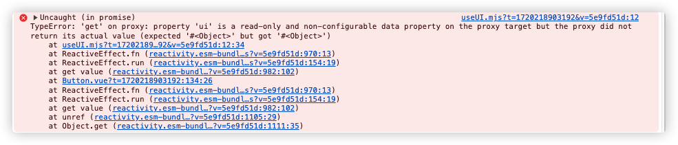

# KB商城国际版
> 主要提供普通商家自己的商品线上销售的直营电商前端系统，采用`Nuxt3.0` + `vue3.0`全家桶进行的项目！

## 项目启动
1. 安装相关的依赖: `pnpm install`
2. 运行项目: `pnpm run dev`

## 项目目录结构
```
national-kb-mall
├─ LICENSE
├─ README.md
├─ api
├─ app.vue
├─ assets
│  ├─ css
│  │  └─ tailwind.css
│  ├─ icons
│  └─ images
├─ components
│  ├─ CopyRight.vue
│  ├─ Navigator.vue
│  ├─ README.md
│  ├─ global
│  └─ icons
│     ├─ 403.vue
│     ├─ 500.vue
│     ├─ C404.vue
│     ├─ Empty.vue
│     └─ Loading.vue
├─ composables
│  └─ useKbFetch.ts
├─ config
│  ├─ app.ts
│  └─ pwa.ts
├─ directives
├─ i18n.config.ts
├─ locates
│  ├─ en.json
│  └─ zh-CN.json
├─ middleware
│  └─ auth.global.ts
├─ nuxt.config.ts
├─ package.json
├─ pages
│  ├─ 404
│  │  └─ index.vue
│  ├─ 500
│  │  └─ index.vue
│  └─ index
│     └─ index.vue
├─ plugins
├─ public
│  └─ favicon.ico
├─ server
│  └─ tsconfig.json
├─ store
├─ tailwind.config.ts
├─ tsconfig.json
└─ utils
```
## 项目所使用的库
1. 官方ui库(@nuxt/ui)，便于快速开发并管理，并自动安装`@nuxtjs/tailwindcss`、`@nuxtjs/color-mode`、`nuxt-icon`模块，**如果已经安装的话，需要手动将已提及到的模块进行移除操作**，而且，关于这个`tailwindcss`，也预先安装了对应的插件: `@tailwindcss/forms`、`@tailwindcss/typography`、`@tailwindcss/aspect-ratio`、`@tailwindcss/container-queries`、`@headlessui/tailwindcss`几大插件，，官网：[https://ui.nuxt.com/](https://ui.nuxt.com/);
2. seo(@nuxt/seo)，统一接管项目的seo的相关模块，包括有：`robots`、`sitemap`、`og image`、`schema.ort`、`seo experiments`、`link checker`；
3. pinia(@pinia-plugin-persistedstate/nuxt)，使app像spa开发维护pinia一样简单，官网：[https://prazdevs.github.io/pinia-plugin-persistedstate/frameworks/nuxt-3.html](https://prazdevs.github.io/pinia-plugin-persistedstate/frameworks/nuxt-3.html)；
4. pwa(@vite-pwa/nuxt)，0配置生成项目的pwa配置，官网：[https://vite-pwa-org.netlify.app/frameworks/nuxt](https://vite-pwa-org.netlify.app/frameworks/nuxt)；
5. vueuse(@vueuse/nuxt)，vue社区提供的三方组合式工具API，官网：[https://vueuse.org/](https://vueuse.org/)
6. 

## 三方插件

### 开发调试`@nuxt/devtools`
> `nuxt`专属的调试开发工具，官网：[https://devtools.nuxt.com/](https://devtools.nuxt.com/)
> 运行成功后，点击页面底部按钮，即可进入`devtools`的可视化界面，如下图所示：

> 接着，需要同意这个`devtools`的权限申请：

> 发起申请后，将会在我们的启动终端中看到这个发起授权申请，如下图所示：

> 下面将对这个`devtools`工作台每个模块功能进行一一说明，如下图所示：


:point_right: 更多相关的此库的介绍，具体可见[官网描述](https://devtools.nuxt.com/guide/features)

:star2: 当我们的页面/组件比较多的时候，我们可以借助于这个`devtools`所提供的`component`模块，切换到对应的视图，可看到当前项目各页面对各个组件的使用/引用情况，如下图所示：


:star2: 由于在项目中即成了`icones`了，因此可通过这个`devtools`的可视化界面入口，切换到对应的视图，并在该视图下进行相关图标的查找工作：


### 样式管理`tailwindcss`
> @nuxt/tailwindcss: 通过对`tailwindcss`的集成，可在项目中方便的使用class来直接作用于样式，且结合[vscode的tailwindcss插件](https://marketplace.visualstudio.com/items?itemName=bradlc.vscode-tailwindcss)，来实现在项目中快速查看类对应的样式，另外，需要在`.vscode/settings.json`文件中配置以下的配置，使其支持语法高亮以及自动提示
```json
{
	"tailwindCSS.experimental.classRegex": ["tw`(.*?)`", "tw\\('(.*?)'\\)", "tw\\(\\s*('(.*?)'|\"(.*?)\")\\s*\\)"],
	"files.associations": {
      "*.css": "tailwindcss"
  },
  "editor.quickSuggestions": {
      "strings": true
  }
}
```
通过上述这样子的配置之后，我们就可以在vue代码中采用 :point_down: 的方式来使用到`tailwindcss`的定义的变量了
```vue
<script setup lang="ts">
	const variantClasses = {
		primary: tw`bg-red-400`,
		second: tw('bg-green-400')
	}
</script>
```

### 多语言支持`i18n`
> `@nuxt/i18n`: 通过对`@nuxt/i18n`的集成，可在项目中方便的配置语言的切换，并将这个`i18n`的语言支持配置，通过下述在`nuxt.config.ts`中的配置，抽离至单独的配置文件中(i18n.config.ts)来进行配置:
```typescript
import zhCN from "./locates/zh-CN.json"
import en from "./locates/en.json"
export default defineI18nConfig(() => ({
  legacy: false,
  locale: 'zhCN',
	fallbackLocale: 'en',
  messages: {
    'en': en,
    'zhCN': zhCN,
  }
}))
```
在这里将所有的语言包配置文件都丢到`locates`目录中，按照对应的文件进行命名！
:point_right: 这样子之后，我们就可以通过在`<template></template>`模版中使用`$t()`方法来引用到对应的语言定义，或者在ts中通过`const i18n = useI18n(); i18n.t('message')`的方式来进行当前语言的自动翻译！
由于拥有`Nuxt3`的自动导入，因此，我们可以通过`const { setLocale } = useI18n()`这个方式获取到一个设置本地访问的站点的语言类型，从而设置给用户展示对应的语言(通过`setLocale('en')`)

:thinking: 但是在随着项目逐渐越来越大的时候，这个语言的定义也会越来越大，因此，需要一个可视化的工具来进行管理，有时甚至还可以直接生成，本项目在`vscode`中进行开发，因此，可借助于`vscode-i18n`插件，实现可视化管理，
并在项目中根据配置的当前语言，展示对应的代码运行效果语言，使用效果如下图所示：

:+1: 还可以通过这个翻译进度栏目，对未翻译到位的信息进行对应的翻译，并在对应的目标语言中追加对应的翻译结果关键词！

## 项目过程文档记录
> 本章节将记录在进行整体项目开发调试过程中所遇到的相关问题，并进行发散性思维，联想相关的知识，并记录下来

### Nuxt相关知识补充

#### Nuxt3中的runtime配置
> 在项目的开发过程中，很经常地需要针对应用程序进行运行时配置，通过运行不同的命令来实现加载不同的环境，请求不同的接口服务的方式，而在`Nuxt`中，则是通过在统一的Nuxt配置文件`nuxt.config.ts`中新增一个属性`runtimeConfig`
```typescript
	// nuxt.config.ts
	export default defineNuxtConfig({
		runtimeConfig: {
			// 下述的这个配置是Nuxt3默认自带的配置
			public: {},
			app: {
				buildId: '',
				baseURL: '/',
				buildAssetsDir: '/_nuxt/',
				cdnURL: ''
			},
			nitro: {
				envPreFix: 'NUXT_'
			},
			// 以下是自己的自定义配置
			apiSecret: '123',	// 这个apiSecret只能在服务端渲染时访问到
			public: {
				// 在public中
				apiBase: '/api'
			}
		}
	})
```
:star2: 从上述的配置我们可以看出客户端渲染与服务端渲染所能够访问到的变量是有所区别的，定义在`runtimeConfig`节点下的变量，能够被服务端所访问到，而且所访问到的都是只读属性的变量，客户端访问不到这个`runtimeConfig`根节点下的变量，只能在根节点下加入一个`public`，在这个`public`节点下的变量都能够被访问到，而且客户端所访问到的变量还可以修改，甚至是响应式的变量

> 当我们结合.env文件来控制加载不同的环境变量的时候，有两点需要注意的
> 1. 在runtimeConfig中定义的变量名称必须以首字母小写并驼峰式的命名方式，而在.env文件中定义的变量则是以`NUXT_`开头，大写字母命名，单词之间用_分割；
> 2. 在.env文件中定义的变量，**必须在这个runtimeConfig节点中存在，以免程序运行时加载不到对应的变量**
```shell
	NUXT_API_SECRET=123
	NUXT_PUBLIC_API_BASE=/api
```

:star2: 当我们在程序中使用不同的文件命名来加载配置的话(比如.env、.env.production、.env.development)，需要在运行的脚本中通过命令来指定将使用哪个环境下的运行时配置！ :point_right: 这个过程就是将环境配置文件中的变量怼到`process.env`对象中！
```shell
nuxt dev --dotenv .env.development
```

:star2: 这个配置文件，在`<template></template>`以及`<script></script>`中，对于配置的访问方式也有所不同，在`<template></template>`中可通过`$config`访问到，而在`<script></script>`中则通过使用组合式api`useRuntimeConfig()`来获取到配置对象！

:warning: 有一个需要注意的是，当我们在生产环境中部署的时候，由于通过打包命令`nuxt build`输出的内容将会是`.output/server/index.mjs`入口文件，这个时候我们是通过执行`node .output/server/index.mjs`的方式来启动服务的， :point_right: 而我们晓得这个命令的执行，它是不会去加载这个配置的，因此，需要通过在命令中告知`node`程序，去加载对应的`.env`环境变量配置！
这个时候，就需要使用追加命令参数的方式，如下所示命令来启动服务
```shell
API_URL=https://api.example.com NODE_ENV=production node .output/server/index.mjs
```
:trollface: 或者是通过自定义一个脚本文件来执行，通过shell命令来执行这个脚本
```shell
	export API_URL=https://api.example.com
	export NODE_ENV=production
	node .output/server/index.mjs
```

:100: 或者如果是在`pm2`中运行的话，则借助于下方的脚本(`ecosystem.config.js`)
```js
module.exports = {
	apps: [
		{
			name: 'nuxt-app',
			script: '.output/server/index.mjs',
      env: {
        NODE_ENV: 'production',
        API_URL: 'https://api.example.com'
      }
		}
	]
}
```
:point_right: 然后再通过`pm2 start ecosystem.config.js`来启动应用！

:thinking: **思考这样子一个问题：我们在不同环境中的环境变量的配置也有可能部分属性是一样的，那么针对这种情况，应该怎样来维护比较好呢？**
:point_right: 考虑将将脚本与环境变量配置结合起来，将公共的部分给抽取到一个类似名为`.env.common`的文件中，然后再分别新增`.env.development`以及`.env.production`，然后自定义一`node`脚本程序`loadEnv`，当运行脚本的程序的时候，根据运行的命令对应的环境，来将`.env.common`与对应环境的配置文件结合起来，合并结果值到统一的一个环境配置文件中(比如.env)
1. 新增自定义加载环境变量的脚本`loadEnv.mjs`
```javascript
import fs from 'fs'
import path from 'path'
import dotenv from 'dotenv'
import { fileURLToPath } from 'url';

// 读取并合并两个配置文件中的信息
function loadEnv(env){
	const __filename = fileURLToPath(import.meta.url)
	const __dirname = path.dirname(__filename)
	const basePath = path.resolve(__dirname)	// 获取当前路径
	const commonEnvPath = path.join(basePath, '.env.common')
	const envPath = path.join(basePath, `.env.${env}`)
	
	// 读取并解析配置文件
	const commonConfig = dotenv.parse(fs.readFileSync(commonEnvPath))
	const envConfig = dotenv.parse(fs.readFileSync(envPath))
	return {
		...commonConfig,
		...envConfig
	}
}

const env = process.env.NODE_ENV || 'development'
const config = loadEnv(env)
for(const key in config){
	process.env[key] = config[key]
}

export default config
```
2. 针对环境变量进行对应的读取动作
```typescript
// nuxt.config.ts
import envConfig from './loadEnv.mjs'
export defineNuxtConfig({
	runtimeConfig: {
    public: {
      baseUrl: envConfig['NUXT_PUBLIC_BASE_URL'],
			common: envConfig['NUXT_PUBLIC_COMMON']
    }
  }
})
```
3. 针对客户端可能会不小心修改到环境变量的值情况，新增typescript类型检测机制，并新增自定义的保护组件式函数`useSafeRuntimeConfig`
```typescript
export const useSafeRuntimeConfig = () => {
	const publicRuntimeConfig = useRuntimeConfig().public	// 获取原始的运行时配置
	return {
		publicConfig: Object.freeze(publicRuntimeConfig),
		runTimeConfig: Object.freeze(useRuntimeConfig())
	}
}
```
4. 使用方式
```vue
<script setup>
const { publicConfig } = useSafeRuntimeConfig()
console.info(publicConfig)
</script>
```

#### Nuxt中的appConfig配置
> 一般来说，一个APP应用，拥有其一些特性(比如站点名称，主题颜色，使用语言等等)，我们可以将这些属性定义到`~/app.config.ts`文件中，但是，对于`Nuxt`而言，定义在`app.config.ts`文件中的属性，都是可以被编辑的，而有些场景下，像站点名称这些是不可以被编辑的，那么 :thinking: 应该怎么做才能够更好的来使用呢？
> :star: 这边采用了自定义新的组合函数来包装`useAppConfig()`的方式，并通过`typescript`的类型检测机制，对原本没有任何类型说明的属性进行了类型定义与说明，实现过程如下所示:

1. 在`app.config.ts`中首先定义app应用的相关特性
```typescript
// app.config.ts
export default defineAppConfig({
	// 应用相关
	appName: 'KB商城',
	// 主题相关
	primaryColor: '#de3428',
	// 使用语言相关
	defaultLanguage: 'zh_cn'
	
})
```
2. 创建自定义组合式api来包装`useAppConfig`
```typescript
// composables/useSafeAppConfig.ts
export interface AppConfig{
	readonly appName: string,
	primaryColor: string,
	defaultLanguage: string
}
// 对外暴露app的自定义属性，且不能直接修改，需要修改的话，则通过这个函数返回的changXXX方法来进行修改
export const useSafeAppConfig = () => {
	const appConfig = useAppConfig() as AppConfig
	const frozenConfig = Object.freeze(appConfig)	// 不可直接修改的app配置对象
	const changeTheme = (color: string) => {
		appConfig.primaryColor = color
	}
	const changeLanguage = (lang: string) => {
		appConfig.defaultLanguage = lang
	}
	return {
		config: frozenConfig,
		changeTheme,
		changeLanguage
	}
}
```
3. 配置类型检测
```typescript
// types/index.d.ts
declare module 'nuxt/schema' {
	// 在类型中声明自定义的appConfig属性
	interface AppConfigInput {
		readonly appName: string,
		primaryColor: string,
		defaultLanguage: string
	}
}
```
4. 使用以及效果


5. 处理与`nuxt-ui`的冲突
由于这里我们使用`Object.freeze()`方法来冻结一个appConfig对象，而这个对象是`Nuxt`内置的一个响应式对象，如果直接使用`Object.freeze`冻结它的话，将会导致一些不可预期的行为，因为可以考虑先审拷贝这个对象，再进行冻结； 

:point_right: 这里可以采用`Vue`的`reactive`和`readonly`方法来替代`Object.freeze()`，关于这个调整后的`useSafeAppConfig.ts`内容如下：
```typescript
// 对外暴露app的自定义属性，且不能直接修改，需要修改的话，则通过这个函数返回的changXXX方法来进行修改
export const useSafeAppConfig = () => {
	const appConfig = reactive(useAppConfig()) as AppConfig
	const frozenConfig = readonly(appConfig)	// 不可直接修改的app配置对象
	
	const changeLanguage = (lang: string) => {
		appConfig.defaultLanguage = lang
	}
	return {
		config: frozenConfig,
		changeLanguage
	}
}
```


#### nuxt.config.ts中的app节点配置
> 在`nuxt.config.ts`存在那么的一个属性`app`，主要用于"静态化"地设置当前webapp应用的配置信息，改属性主要有以下那么一些成员属性
| 属性 | 描述 | 默认值 |
|---|---|---|
| baseURL | 站点的根路径 | '/' |
| buildAssetsDir | 已生成站点资源的文件夹名称 | '/_nuxt/' |
| cdnURL | 用于提供公共文件夹的绝对URL（仅限生产） | '' |
| head | 用于设置所有页面的head节点 | `见下方关于head的定义` |
| keepalive | 页面之间keepalive配置的默认值，可由页面中的`definePageMeta`覆盖 | false |
| layoutTransition | 布局间的动画，可由页面中的`definePageMeta`覆盖 | false |
| pageTransition | 页面间的动画，可由页面中的`definePageMeta`覆盖 | false |
| rootAttrs | 自定义根节点的属性 | `{"id": "__nuxt"}` |
| rootId | 根节点id | "__nuxt" |
| rootTag | 根节点名称 | `div` |
| teleportAttrs |  |  |
| teleportId |  |  |
| teleportTag |  |  |
| viewTransition |  |  |

##### 关于head的定义
```json
{
  "meta": [
    {
      "name": "viewport",
      "content": "width=device-width, initial-scale=1"
    },
    {
      "charset": "utf-8"
    }
  ],
  "link": [],
  "style": [],
  "script": [],
  "noscript": []
}
```

##### 关于静态化head设置、动态化全局设置、具体页面单独设置的区别
> :point_up_2: 我们发现可以在`nuxt.config.ts`中定义`app.head`节点来静态化设置所有页面的head标签，但是在实际的情况下，则会出现全局的动态化设置、或者是具体到某个页面来设置，因此，`Nuxt3`提供了`useHead()`以及`useSafeHead()`
> 而这个`useHead()`函数参数成员的签名如下：
```typescript
useHead(meta: MaybeComputedRef<MetaObject>): void
interface MetaObject {
  title?: string
  titleTemplate?: string | ((title?: string) => string)
  base?: Base
  link?: Link[]
  meta?: Meta[]
  style?: Style[]
  script?: Script[]
  noscript?: Noscript[]
  htmlAttrs?: HtmlAttributes
  bodyAttrs?: BodyAttributes
}
```
关于各个字段属性如何传参，具体见[官网](https://github.com/unjs/unhead/blob/main/packages/schema/src/schema.ts)

:point_right: `useHead`是一个组合式API，一般在`*.vue`文件中使用，而在`Nuxt`中又提供了不同类型的*.vue(app.vue、`layouts/default.vue`、`pages/**.vue`)，那么我们可以得出这样子的一个结论：**`nuxt.config.ts`一般用于设置静态的页面公共配置，app.vue中用来设置动态的公共配置，`layouts/default.vue`则根据页面所使用的模版，来提供针对模版级别的动态公共配置，而`pages/**.vue`则是针对某个页面自行进行个性化的配置，颗粒度达到最细！**

##### useSeoMeta与useHead
> 在`Nuxt3`中，`useHead`与`useSeoMeta`都是用来设置页面的头部信息(meta信息)，但是他们的功能与使用场景各有不同，首先`useHead`是一个比较通用的方法，用于设置页面的任何头部信息(也就是说在`<head></head>`标签中的信息都可以被设置)，如下代码所示：
```vue
<script setup>
import { useHead } from '#imports'

useHead({
  title: 'Page Title',
  meta: [
    { name: 'description', content: 'Page description' },
    { property: 'og:title', content: 'Open Graph Title' }
  ],
  link: [
    { rel: 'stylesheet', href: 'https://example.com/style.css' }
  ],
  script: [
    { src: 'https://example.com/script.js', type: 'text/javascript' }
  ]
})
</script>

```
> 而`useSeoMeta`则是一个专门用来设置与SEO相关meta标签的方法，它提供了一个更简化的API，专注于SEO方面的meta信息，比如TDK、Open Graph标签等，使用`useSeoMeta`可以更方便地管理和设置与SEO相关的内容，如下所示：
```vue
<script setup>
import { useSeoMeta } from '#imports'

useSeoMeta({
  title: 'Page Title',
  description: 'Page description',
  keywords: 'keyword1, keyword2',
  ogTitle: 'Open Graph Title',
  ogDescription: 'Open Graph description',
  ogImage: 'https://example.com/image.jpg'
})
</script>
```

##### app配置与seo配置
> 结合上述知识的学习，可以得出以下的一个比较合适的项目实践：
1. 将需要固化的数据存储到`app.config.ts`文件中；
2. 不在`nuxt.config.ts`文件中设置这个与`head`有关的配置，采用在`app.vue`中通过`useHead`来设置动态化的公共配置，这样子可以通过`useAppConfig`方法来访问到；
3. 在明确系统中有几套`layout`的时候，可以采用针对不同的layout采用不同的head；
4. 具体到某些页面需要展示对应该页面的一些自定义属性时，则可采用在具体的`pages/**.vue`中使用`useHead`来设置对应的；
5. 在上述4点中`useHead`仅用来设置与`seo`无关的设置，将与`seo`相关的设置，采用`useSeoMeta`来设置(TDK+OG)

:thinking: 在实际的项目过程中，经常性地需要先设置站点的名称，然后在某些页面中采用拼接的方式来追加当前页面的名称，那么这种情况，应该如何处理呢？

:point_right: 可采用`useHead`中的`titleTemplate`属性(该属性是一个可格式化的字符串或者是一个返回字符串的函数)，一般情况下，通过在`app.vue`中设置这个`titleTemplate`属性，来控制标题的格式，然后在具体的页面直接定义即可，比如有：
```vue
<script>
// app.vue
useHead({
	titleTemplate: '%s - 站点名称',
	// 也可以采用函数的方式更加灵活
	titleTemplate: (title) => title ? `${title} - 站点名称` : '站点名称'
})
</script>
```
然后在具体的页面中直接使用页面名称
```vue
<script>
// test.vue
useHead({
	title: '我是test页面'
	// 将会渲染为`我是test页面 - 站点名称`
})
</script>
```

##### Nuxt中的自动导入
> 在`Nuxt`中将会自动导入像`components`、`composables`、`utils`这3个目录中的文件，使得可以直接在项目中(合适的上下文)来直接调用这几个目录的文件，一般在`nuxt.config.ts`文件中配置自动导入的目录，来告知`Nuxt`将支持哪些目录哪些文件的自动导入机制！
> :thinking: 那么这种自动导入的机制是如何实现的呢？为什么配置了这个目录，就可以实现自动导入的目的了呢？
> 这时因为这个`Nuxt`在启动的时候，有以下的几个流程步骤，来实现这个自动导入的目的：
1. 扫描特定目录：`Nuxt`在启动的时候会扫描特定目录，如`components`、`composables`、`utils`等，找到所需要的目录并自动导入文件，这些目录也就是在`nuxt.config.ts`中配置的；
2. 生成自动导入文件：扫码完目录后，`Nuxt`会生成一个或者多个自动导入文件，通常包括`auto-imports.d.ts`以及`components.d.ts`，这些文件被放置在`.nuxt`目录中
```typescript
// auto-imports.d.ts
import { useExample } from '../composables/useExample'
import { helperFunction } from '../utils/helper'
declare module 'vue' {
  interface ComponentCustomProperties {
    useExample: typeof useExample
    helperFunction: typeof helperFunction
  }
}
export {}
```
3. 注入全局上下文：生成的自动导入文件会在项目构建/运行时被加载，并将其内容注入到全局上下文中，使其在整个应用中可用
```typescript
// components.d.ts
declare module 'vue' {
  export interface GlobalComponents {
    MyButton: typeof import('~/components/MyButton.vue').default
    MySubComponent: typeof import('~/components/subdirectory/MySubComponent.vue').default
  }
}
export {}
```
4. 内部插件机制：上述第3步仅仅是类型的声明，而实际使得程序上能够直接调用这个全局自动导入的属性，则是通过在`Nuxt`中生成一个内部插件(auto-imports.mjs)文件，当`Nuxt`启动时，加载这个插件，将所有收集到的工具函数和组件注入到全局上下文中，生成的自动导入插件内容如下：
```typescript
// 内部插件示例（示意性代码）
import { defineNuxtPlugin } from '#app'
import { useExample } from '~/composables/useExample'
import { helperFunction } from '~/utils/helper'

export default defineNuxtPlugin((nuxtApp) => {
	nuxtApp.provide('useExample', useExample)
	nuxtApp.provide('helperFunction', helperFunction)
})
```

:trollface: 如果我想要自定义自动导入的话，只需要在`app.config.ts`中进行配置即可，如下配置所示
```typescript
export default defineNuxtConfig({
	components: {
		global: true,
		dirs: ['~/components/global']
	},
	imports: {
		dirs: ['composables', 'composables/*/index.{ts, js, mjs, mts}', 'composables/**']
	}
})
```

:thinking: 但是，有时候，我们并非是直接在`<template></template>`使用组件的，而是采用动态组件的方式来使用的，这个时候，我们就需要手动导入组件的方式：
```vue
<script lang="ts" setup>
import { CustomComponent } from '#components'
const MyButton = resolveComponent('MyButton')
</script>
<template>
	<component :is="clickable ? MyButton : 'div'"></component>
	<component :is="CustomComponent"></component>
</template>
```

#### Nuxt中的插件
> `Nuxt3`提供了像`vue`类似的插件机制，允许我们通过在`plugins`目录中创建自定义插件的方式，来往`nuxt`实例追加逻辑、属性、动作的方式，以及提供全局属性的机制，通过自定义的钩子来创建自定义钩子动作，使用既定的钩子来实现对应的目的，整理了一下可提供的功能有：
1. 注册既定的钩子，也可注册自定义钩子；
2. 通过`provide`来提供全局的属性以及方法；
3. 凭借`nuxtApp.vueApp`属性，可实现往vue实例中添加全局动作(插件、组件、指令等)；

##### Nuxt插件定义的两种不同方式
1. 最基本的使用方式：函数参数
```typescript
export default defineNuxtPlugin(nuxtApp => {
	// 对nuxtApp对象进行相关的操作
})
```
2. 较全的使用方式：对象参数
```typescript
export default defineNuxtPlugin({
	name: 'my-plugin',
	enfore: 'pre',
	async setup(nuxtApp){
		// 与上述的函数参数的插件定义方法功能一致
	},
	order: number,	// 插件加载的顺序排序
	dependsOn: [],// 依赖于其他的插件
	parallel: boolean,
	hooks: {
		// 直接注册插件的运行时钩子函数
		'app:create'() {
			const nuxtApp = useNuxtApp()
		}
	},
	env: {
		islands: true
	}
})
```
:trollface: 上述的对象参数方式调用的时候，如果`hooks`以及`nuxtApp.hook`都注册了同样名称的钩子函数动作的话， hooks中定义的钩子将优先于`nuxtApp.hook`中定义的钩子！

##### Nuxt插件中nuxtApp对象的组成


:point_right: 在实际的coding中，除了可以在自定义插件访问到这个`nuxtApp`实例之外，还可以通过组合式函数`useNuxtApp()`来访问到运行中的nuxtApp实例！！！

##### nuxtApp中所涉及到的钩子函数都有哪些
| 钩子函数 | 描述 |
|---|:---|
| `app:created` | 在`Nuxt`应用实例创建之后立即触发，适用于需要在应用初始化阶段执行的逻辑 |
| `app:beforeMount` | 在`Nuxt`应用挂在到DOM之前触发，适用于在应用挂在之前需要执行的操作 |
| `app:mounted` | 在`Nuxt`应用挂载到DOM之后触发，适用于在应用已经挂在之后需要执行的操作 |
| `app:rendered` | 在应用完成第一次渲染之后触发，适用于需要在初次渲染完成后执行的操作，例如分析渲染时间 |
| `app:redirected` | 在应用执行重定向时触发，适用于需要在重定向发生时执行的操作 |
| `app:suspense:resolve` | 当一个Suspense组件的所有异步依赖解析完毕时触发，适用于处理Suspense的解析逻辑 |
| `app:error` | 当应用中发生错误时触发，适用于全局错误处理 |
| `app:error:cleared` | 当错误状态被清除时触发，适用于清理错误的相关逻辑 |
| `app:chunkError` | 当应用中发生代码分开(chunk)错误时触发，适用于处理代码分块加载错误 |
| `app:data:refresh` | 当应用中的数据需要刷新时触发，适用于数据刷新逻辑 |
| `app:manifest:update` | 当应用的manifest文件更新时触发，适用于处理manifest文件更新的逻辑 |
| `dev:ssr-logs` | 在开发模式下，服务端渲染日志输出时触发，适用于在开发模式下处理SSR日志 |
| `link:prefetch` | 当应用预取链接时触发，适用于处理链接预取逻辑 |
| `page:start` | 在页面开始加载时触发，适用于页面加载开始时的逻辑 |
| `page:finish` | 在页面加载完成时触发，适用于页面加载完成后的逻辑 |
| `page:transition:start` | 在页面过度开始时触发，适用于处理页面过度开始逻辑 |
| `page:transition:finish` | 在页面过度结束时触发 |
| `page:view-transition:start` | 在视图过渡开始时触发 |
| `page:loading:start` | 在页面加载指示器开始时触发 |
| `page:loading:end` | 在页面加载指示器结束时触发 |
| `vue:setup` | 在vue组件setup函数执行前触发 |
| `vue:error` | 当vue组件捕获到错误时触发 |


#### Nuxt中间件
> `Nuxt`提供了中间件来在导航到特定路由之前运行对应的代码的机制！它提供了一个可定制的路由中间件框架，使得我们可以在整个应用程序中使用，非常适合在导航到特定路由之前提取我们想要运行的代码，可分为三种类型的中间件(这有点类似于`vue-router`中的路由守卫)：
1. 全局所有路由中间件，存放于`middleware/`目录中，一般已`.global.ts`结尾；
2. 命名路由中间件，存放于`middleware/`目录中，需要使用时需要在具体的页面中通过`usePageMeta`函数来声明；
3. 匿名路由中间件，没有具体文件命名，一般由具体页面通过`usePageMeta`来定义

:star: 一般中间件的定义，是通过`defineNuxtRouteMiddleware()`函数来声明定义的，如下代码所示：
```typescript
	export default defineNuxtRouteMiddleware((to, from) => {
		if(to.params.id === '1'){
			return absortNavigation()
		}
		if(to.path !== '/'){
			return navigateTo('/')
		}
	})
```
:star2:  在上述的代码中，在中间件上下文提供了全局的`absortNavigation()`以及`navigateTo()`方法，分别用于重定向操作以及终止路由跳转动作！关于这个`navigateTo`的具体用法见[官网](https://nuxt.com/docs/api/utils/navigate-to)

:star: 然后在具体的页面中通过`usePageMeta()`方法来声明路由使用顺序
```vue
<script setup lang="ts">
	definePageMeta({
		middleware: ['auth', (to, from) => {}]
	})
</script>
```

##### 动态的路由中间件
> `Nuxt`还提供了`addRouteMiddleware()`方法来帮助我们创建并使用动态的路由中间件，如下代码所示：
```typescript
export default defineNuxtPlugin(nuxtApp => {
	addRouteMiddleware('global-middleware', (to, from) => {
		console.info('我是全局的动态路由中间件')
	}, { global: true })
	addRouteMiddleware('named-middleware', (to, from) => {
		console.info('我是命名路由中间件')
	})
})
```

#### Nuxt中的服务端
> 在`Nuxt3`中提供了`server`目录，通过在此目录下创建的文件夹/文件，都将会映射为对应的(接口)服务，比如有下述的文件夹结构：
```shell
-| server/
---| api/
-----| hello.ts      # /api/hello
---| routes/
-----| bonjour.ts    # /bonjour
---| middleware/
-----| log.ts        # 将捕获所有的请求中间件
---| utils/
-----| utils.ts        # 
```
:point_right: 我们可以简单地这样子认为：一切定义在`server`目录下的js脚本，都将会根据其文件目录、文件名称，映射成为后台的(接口)服务，在该目录下的服务，一般通过下述的方式来定义
```typescript
import type { EventHandler, EventHandlerRequest, H3Event } from 'h3'
export default defineEventHandler((event: H3Event<EventHandlerRequest>) => {
	return {
		hello: 'world'
	}
})
```
:point_right: 关于这个`H3Event`的使用，具体可见[h3官网Event](https://h3.unjs.io/guide/event)的具体介绍

### 踩坑之路
> 记录在项目过程中所踩的坑
#### 升级了版本之后发现sharp不兼容
> 打开一个比较久的项目，升级相关的库版本信息，发现`sharp`不兼容（一个将常见格式的大图像转换为较小的、web友好的不同格式的图片）， :point_right: 但是要求这个node的版本必须大于18.17.0，因此需要对应升级一下！


### 最佳实践

#### 是否可以动态化defineNuxtConfg来配置
> 在`Nuxt3`中，可以通过`defineNuxtConfig`函数来配置对象的基础配置，那么 :thinking: 传递的对象能否由一个函数返回，从而来实现动态化配置的目的？
> 这种方式不可以 :no_good_man: 的，因为`Nuxt3`的配置文件设计的初衷就是想通过静态化的配置来生成app的配置
> :point_right: 但是，我们还是可以通过一个**结果对象(可以结合环境变量等方式来生成的一个对象)**，传递给`defineNuxtConfig`函数，提前生成一个运行好的结果配置对象传递给它，实现设想中的动态化配置的目的！
```typescript
	const settting = {}
	export default defineNuxtConfig(setting)
```

#### 可对照开发的tailwindcss配置
> 在运行项目的时候，当我们不清楚这个`tailwindcss`的相关类时，可借助于本地运行的一个服务(访问地址：http://localhost:3000/_tailwind/)，即可在当前的环境中浏览相关的class所对应的样式以及样式值，因为在启动`Nuxt`的时候，会顺便启动这个服务，启动命令输出如下：

>而打开此路径对应的效果如下图所示：


#### 页面级别的自定义组件
> 由于`Nuxt3`会自动扫描`pages`目录下的vue文件来生成对应的路由，而在实际的项目coding过程中，会经常性地在页面级别创建专属于页面级别的子组件，这个时候不想让这个子组件被当作路由来使用，可以通过将子组件给命名为`_XXX.vue`的方式，来自定义命名并使用，因为下划线前缀不会被`Nuxt`用来生成路由的！
```vue
<template>
	<div>
		<MyComponent></MyComponent>
	</div>
</template>
<script setup lang="ts">
import MyComponent from './component/MyComponent.vue'
</script>
```

#### 集成Mock服务
> 在`Nuxt3`中并不存在这个`Mock`相关的模块，也没有开箱即用的三方库，因此这边根据之前的项目经验，进行对应的调整
1. 安装相关的依赖：`pnpm i mockjs`以及`pnpm i --save-dev @types/mockjs`
2. 在根目录中创建`mock`文文件夹，并对外暴露统一的`index.ts`，该`index.ts`主要是将业务模块`modules`文件夹中的模块进行一一加载，并通过`url+method`拼接的方式作为key，`response`作为value，对外提供一个完整的mock对象
3. 在`server`目录中新建`api/mock/[...].ts`统一的mock访问接口文件，然后通过获取`event`请求信息，从mock对象中匹配到对应的response函数，进行输出对应的响应结果；
4. 在runtimeConfig配置中添加是否mock的标识，结合统一的自定义`useKbFetch`组合式API，当开启mock的时候，则请求`/api/mock${url}`路径，当没有开启mock的时候，则请求`/api${url}`路径，实现一键切换mock的机制！

## 思考总结
