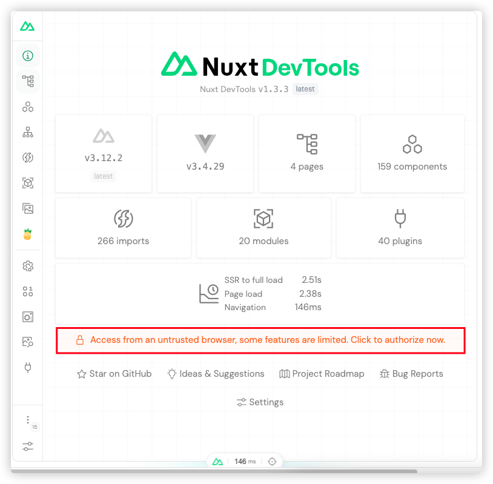

# KB商城国际版
> 主要提供普通商家自己的商品线上销售的直营电商前端系统，采用`Nuxt3.0` + `vue3.0`全家桶进行的项目！

## 项目启动
1. 安装相关的依赖: `pnpm install`
2. 运行项目: `pnpm run dev`

## 项目目录结构
```
national-kb-mall
├─ LICENSE
├─ README.md
├─ api
├─ app.vue
├─ assets
│  ├─ css
│  │  └─ tailwind.css
│  ├─ icons
│  └─ images
├─ components
│  ├─ CopyRight.vue
│  ├─ Navigator.vue
│  ├─ README.md
│  ├─ global
│  └─ icons
│     ├─ 403.vue
│     ├─ 500.vue
│     ├─ C404.vue
│     ├─ Empty.vue
│     └─ Loading.vue
├─ composables
│  └─ useKbFetch.ts
├─ config
│  ├─ app.ts
│  └─ pwa.ts
├─ directives
├─ i18n.config.ts
├─ locates
│  ├─ en.json
│  └─ zh-CN.json
├─ middleware
│  └─ auth.global.ts
├─ nuxt.config.ts
├─ package.json
├─ pages
│  ├─ 404
│  │  └─ index.vue
│  ├─ 500
│  │  └─ index.vue
│  └─ index
│     └─ index.vue
├─ plugins
├─ public
│  └─ favicon.ico
├─ server
│  └─ tsconfig.json
├─ store
├─ tailwind.config.ts
├─ tsconfig.json
└─ utils
```
## 项目所使用的库
1. 官方ui库(@nuxt/ui)，便于快速开发并管理，并自动安装`@nuxtjs/tailwindcss`、`@nuxtjs/color-mode`、`nuxt-icon`模块，**如果已经安装的话，需要手动将已提及到的模块进行移除操作**，而且，关于这个`tailwindcss`，也预先安装了对应的插件: `@tailwindcss/forms`、`@tailwindcss/typography`、`@tailwindcss/aspect-ratio`、`@tailwindcss/container-queries`、`@headlessui/tailwindcss`几大插件，，官网：[https://ui.nuxt.com/](https://ui.nuxt.com/);
2. seo(@nuxt/seo)，统一接管项目的seo的相关模块，包括有：`robots`、`sitemap`、`og image`、`schema.ort`、`seo experiments`、`link checker`；
3. pinia(@pinia-plugin-persistedstate/nuxt)，使app像spa开发维护pinia一样简单，官网：[https://prazdevs.github.io/pinia-plugin-persistedstate/frameworks/nuxt-3.html](https://prazdevs.github.io/pinia-plugin-persistedstate/frameworks/nuxt-3.html)；
4. pwa(@vite-pwa/nuxt)，0配置生成项目的pwa配置，官网：[https://vite-pwa-org.netlify.app/frameworks/nuxt](https://vite-pwa-org.netlify.app/frameworks/nuxt)；
5. vueuse(@vueuse/nuxt)，vue社区提供的三方组合式工具API，官网：[https://vueuse.org/](https://vueuse.org/)
6. 

## 三方插件
1. @nuxt/devtools:
> `nuxt`专属的调试开发工具，官网：[https://devtools.nuxt.com/](https://devtools.nuxt.com/)
> 运行成功后，点击页面底部按钮，即可进入`devtools`的可视化界面，如下图所示：

> 接着，需要同意这个`devtools`的权限申请：

> 发起申请后，将会在我们的启动终端中看到这个发起授权申请，如下图所示：

> 下面将对这个`devtools`工作台每个模块功能进行一一说明，如下图所示：


:point_right: 更多相关的此库的介绍，具体可见[官网描述](https://devtools.nuxt.com/guide/features)

:star2: 当我们的页面/组件比较多的时候，我们可以借助于这个`devtools`所提供的`component`模块，切换到对应的视图，可看到当前项目各页面对各个组件的使用/引用情况，如下图所示：


:star2: 由于在项目中即成了`icones`了，因此可通过这个`devtools`的可视化界面入口，切换到对应的视图，并在该视图下进行相关图标的查找工作：


2. @nuxt/tailwindcss: 通过对`tailwindcss`的集成，可在项目中方便的使用class来直接作用于样式，且结合[vscode的tailwindcss插件](https://marketplace.visualstudio.com/items?itemName=bradlc.vscode-tailwindcss)，来实现在项目中快速查看类对应的样式，另外，需要在`.vscode/settings.json`文件中配置以下的配置，使其支持语法高亮以及自动提示
```json
{
	"tailwindCSS.experimental.classRegex": ["tw`(.*?)`", "tw\\('(.*?)'\\)", "tw\\(\\s*('(.*?)'|\"(.*?)\")\\s*\\)"],
	"files.associations": {
      "*.css": "tailwindcss"
  },
  "editor.quickSuggestions": {
      "strings": true
  }
}
```
通过上述这样子的配置之后，我们就可以在vue代码中采用 :point_down: 的方式来使用到`tailwindcss`的定义的变量了
```vue
<script setup lang="ts">
	const variantClasses = {
		primary: tw`bg-red-400`,
		second: tw('bg-green-400')
	}
</script>
```


## 项目过程文档记录
> 本章节将记录在进行整体项目开发调试过程中所遇到的相关问题，并进行发散性思维，联想相关的知识，并记录下来

### Nuxt相关知识补充

### 踩坑之路
> 记录在项目过程中所踩的坑
#### 升级了版本之后发现sharp不兼容
> 打开一个比较久的项目，升级相关的库版本信息，发现`sharp`不兼容（一个将常见格式的大图像转换为较小的、web友好的不同格式的图片）， :point_right: 但是要求这个node的版本必须大于18.17.0，因此需要对应升级一下！


### 最佳实践

#### 可对照开发的tailwindcss配置
> 在运行项目的时候，当我们不清楚这个`tailwindcss`的相关类时，可借助于本地运行的一个服务(访问地址：http://localhost:3000/_tailwind/)，即可在当前的环境中浏览相关的class所对应的样式以及样式值，因为在启动`Nuxt`的时候，会顺便启动这个服务，启动命令输出如下：

>而打开此路径对应的效果如下图所示：


## 思考总结
